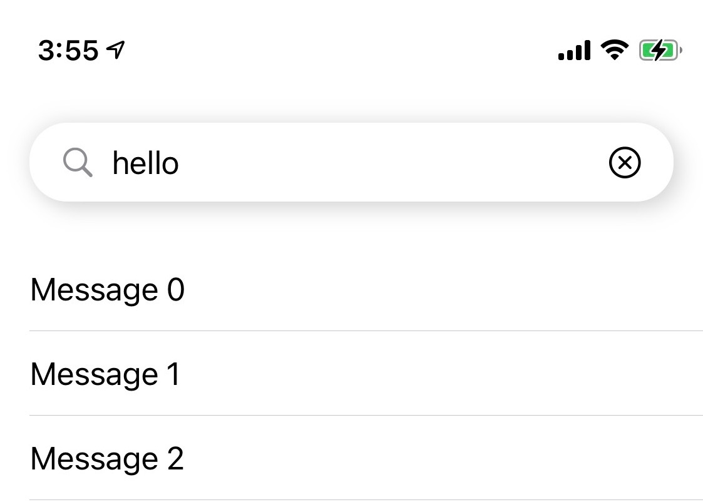
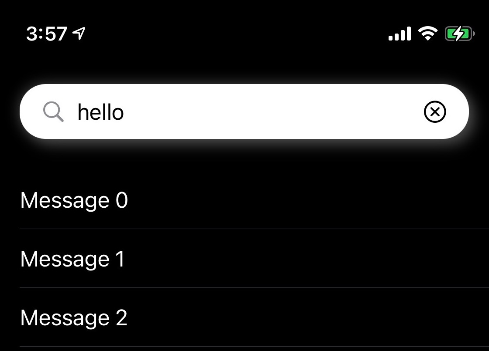

# SwiftUI SearchBar

## Intro

A search bar written in swift ui, compatible with dark mode.

## Screenshots

## Usage

Get the contents of SearchBar.swift in the warehouse as a new file for your project.